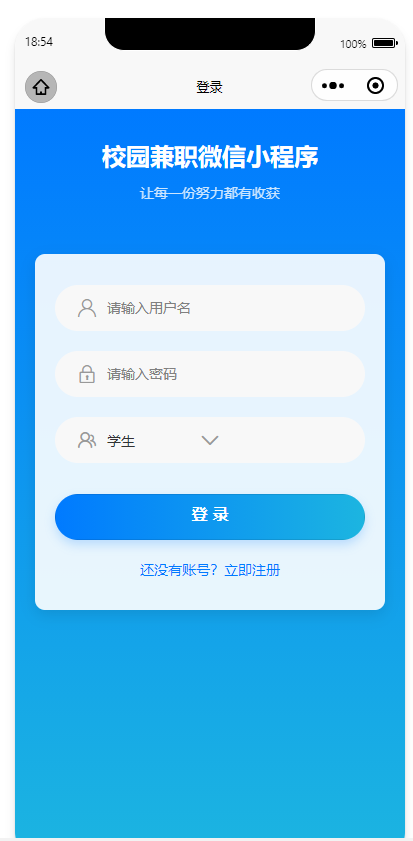
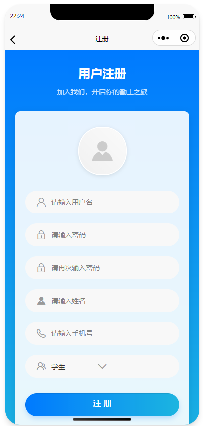
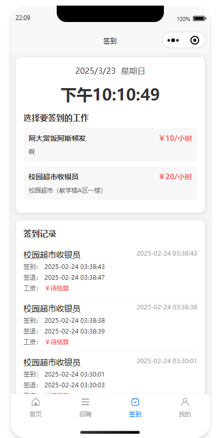
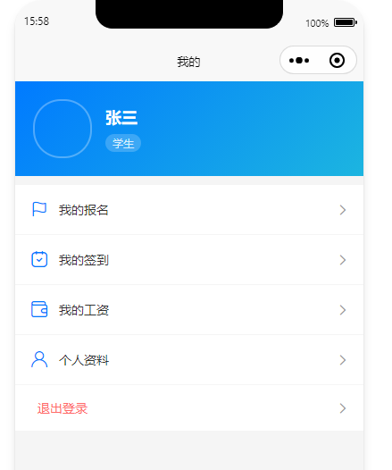
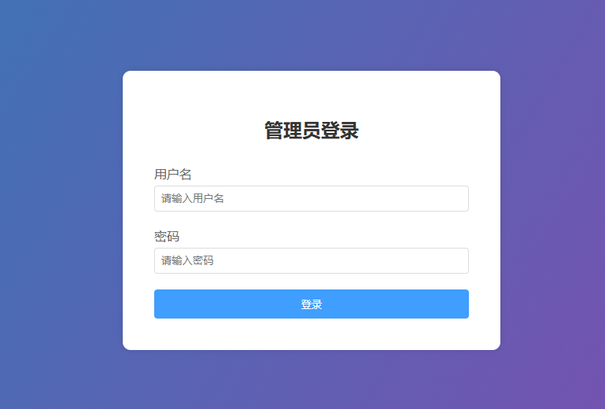
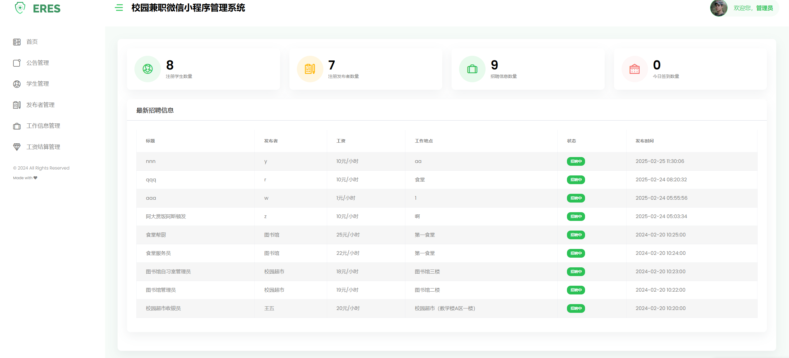

# Campus Part-Time Job Platform | 微信小程序校园兼职平台

A **full-stack WeChat Mini Program** designed for managing **campus part-time jobs**, built with **Spring Boot, Vue.js, MySQL**, and **WeChat Mini Program framework**.  
该系统是一个 **全栈微信小程序**，用于管理 **校园兼职工作**，基于 **Spring Boot, Vue.js, MySQL** 和 **微信小程序框架** 开发。  
It provides a platform for **students, employers, and administrators** to efficiently exchange and manage part-time job information.  
系统为 **学生、雇主和管理员** 提供高效的兼职工作交流与管理平台。

---

## 🚀 Features 功能
### Student 学生端
- Register/Login, manage personal profile | 注册/登录，管理个人信息  
- Browse and apply for part-time jobs | 浏览并申请兼职  
- Track application history and attendance | 跟踪申请历史与出勤情况  
- View notifications and salary details | 查看通知与工资信息  

### Employer 雇主端
- Post and manage job listings | 发布与管理职位信息  
- Review and approve student applications | 审核学生申请  
- Track workforce attendance and salary management | 管理员工出勤与薪资  

### Administrator 管理员端
- Verify job postings and employer legitimacy | 审核职位与雇主合法性  
- Manage user accounts (students/employers) | 管理用户账号（学生/雇主）  
- Handle complaints and push announcements | 处理投诉并发布公告  

---

## 🛠️ Tech Stack 技术栈
- **Backend:** Spring Boot + MyBatis  
- **Frontend:** WeChat Mini Program (WXML, WXSS, JavaScript), Vue.js (for admin panel)  
- **Database:** MySQL + Redis (caching)  
- **Security:** Spring Security + JWT authentication  
- **Deployment:** Docker (supports scaling)  

后端：Spring Boot + MyBatis  
前端：微信小程序（WXML, WXSS, JavaScript）、Vue.js（管理后台）  
数据库：MySQL + Redis（缓存）  
安全：Spring Security + JWT  
部署：Docker（支持扩展）  

---

## 📂 Database Design 数据库设计
- **Core tables:** `user`, `job_base`, `job_detail`, `apply_base`, `checkin_base`, `salary_base`, `notice_base`  
- **Highlights:**  
  - Multi-role user system (student, employer, admin)  
  - Job application & approval workflow  
  - Attendance tracking with check-in/check-out records  
  - Salary calculation and payment tracking  

核心表：`user`, `job_base`, `job_detail`, `apply_base`, `checkin_base`, `salary_base`, `notice_base`  
设计亮点：  
- 多角色用户体系（学生、雇主、管理员）  
- 兼职申请与审核流程  
- 出勤记录（签到/签退）  
- 工资计算与发放管理  

---

## 🎨 Preview | 效果图展示

### 🧑‍🎓 Student Side | 学生端

**🏠 Home Page | 首页界面**  

**📝 Register Page | 用户注册**  

**📋 Job List | 职位列表**  

**⏰ Check-in Page | 签到页面**  

**👤 Profile Center | 学生端个人中心**  

---

### 🛠️ Admin Side | 管理员端

**🔑 Login Page | 管理员后台登录页面**  

**📊 Dashboard | 管理员后台**  

